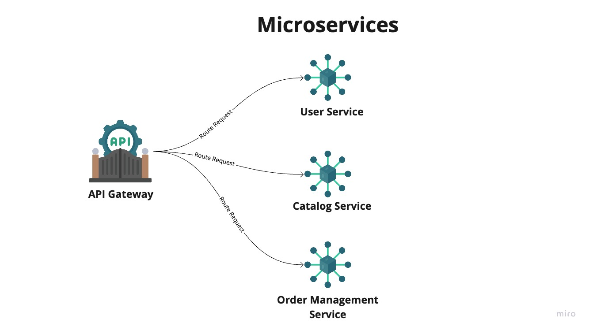

# BookElse

BookElse is an online platform for booking a book as rental or buying.

## System Architecture

This application is built in Spring Boot, and Spring Cloud, and Java. It is based on microservice architecture. Brief system architecture is described below.

Here, API Gateway authorize the request, If the request is authorized then it routes the request to respective microservice.

There are three mainly microservices.
- User Service
    
    This service is mainly focus for user management.
     - User Registration
     - User Authorization / Authentication
     - User Data Management
- Catalog Service
    
    This service is mainly focus for product management.
     - It maintain rental and selling products
     - Product Data Management
     - Maintain Inventory with vendor

- Order management
    
    This service is mainly focus for order management.
     - It manage customer orders
     - Product Payment
     - Product Shipping / Delivery
     - Customer Rental Product Management